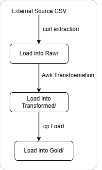

# Linux and Git Project — Bash ETL Pipeline

## Overview

This project was completed as part of the CoreDataEngineers (CDE) Bootcamp 3.0 Linux and Git assignment.

The objective of the assignment was to demonstrate practical knowledge of Linux, Bash scripting, file management, process automation, and Git version control by building a simple command-line ETL (Extract, Transform, Load) pipeline.

The project uses Bash scripting and standard Linux command-line utilities to:

1. Download a CSV dataset from an external source.
2. Store the raw dataset in a `raw` directory.
3. Transform the dataset by:
   - Renaming `Variable_code` to `variable_code`.
   - Selecting only the required columns:
     - `year`
     - `Value`
     - `Units`
     - `variable_code`
4. Store the transformed dataset in a `Transformed` directory.
5. Load the transformed dataset into a `Gold` directory.
6. Schedule the ETL pipeline to run automatically every day at 12:00 AM using a cron job.
7. Create a separate Bash script that moves CSV and JSON files into a `json_and_CSV` directory.
8. Version-control the project using Git.

# Project Objectives

The project was designed to demonstrate the following Data Engineering and Linux concepts:

- Linux filesystem navigation
- Bash scripting
- Environment variables
- Shell variables
- Command-line utilities
- File and directory management
- Data extraction
- Basic data transformation
- Data loading
- Conditional statements
- Loops
- File existence checks
- Cron job scheduling
- Git branching and version control
- Git commits and remote repositories
- Project documentation

# Project Architecture

The ETL pipeline follows a simple three-stage architecture:

The following diagram illustrates the architecture and flow of the Bash ETL pipeline:

Directory responsibilities

| Directory       | Purpose                                                       |
| --------------- | ------------------------------------------------------------- |
| `scripts/`      | Contains the Bash scripts used in the project                 |
| `raw/`          | Stores the original downloaded CSV dataset                    |
| `Transformed/`  | Stores the transformed dataset                                |
| `Gold/`         | Stores the final dataset after the load stage                 |
| `json_and_CSV/` | Stores CSV and JSON files moved by the file-management script |

Technologies and Tools

The project was implemented using Linux command-line tools and Bash.

## Tools used
Bash
Linux/Ubuntu
curl
awk
mkdir
cp
mv
basename
ls
head
chmod
find
printf
cron
Git
GitHub

- Task 1 — Bash ETL Pipeline
## Extract

The first stage of the pipeline downloads the source CSV dataset.

The dataset is the Annual Enterprise Survey 2023 financial year provisional dataset published by Statistics New Zealand.

The source URL is stored in an environment variable:

export CSV_URL="https://www.stats.govt.nz/assets/Uploads/Annual-enterprise-survey/Annual-enterprise-survey-2023-financial-year-provisional/Download-data/annual-enterprise-survey-2023-financial-year-provisional.csv"

Using an environment variable prevents the URL from being hardcoded directly into the curl command.

Using an environment variable prevents the URL from being hardcoded directly into the curl command.

curl -L "$CSV_URL" -o "$RAW_FILE"

*Why curl is used*

curl is a Linux command-line utility used to transfer data from a URL.

In this project it is used to download the source CSV file.

The -L option allows curl to follow HTTP redirects.

The -o option specifies the output file.

The downloaded file is stored in: raw/

The script also checks whether the file exists after the download:

if [ -f "$RAW_FILE" ]; then
    echo "SUCCESS: CSV file saved to:"
    echo "$RAW_FILE"
else
    echo "ERROR: CSV file was not saved."
    exit 1
fi

This provides a confirmation message and prevents the pipeline from continuing if extraction fails.

## Transform

After extraction, the raw CSV is transformed using awk.

The transformation performs two operations:

Renames Variable_code to variable_code.
Selects only the required columns.

The required columns are:

- year
- Value
- Units
- variable_code

The transformation does not assume that these columns are in a specific position in the CSV.

Instead, awk examines the header row and determines the position of each required column.

The relevant logic is:

NR == 1 {
    for (i = 1; i <= NF; i++) {
        if ($i == "year") year_col = i
        if ($i == "Value") value_col = i
        if ($i == "Units") units_col = i
        if ($i == "Variable_code") variable_col = i
    }

    print "year", "Value", "Units", "variable_code"
    next
}
*Why awk is useful here*

awk is particularly useful for processing structured text and delimited files from the Linux command line.

Instead of assuming:

year = column 1
Value = column 2
Units = column 3
Variable_code = column 4

the script searches for the column names in the header.

This makes the transformation more robust if the order of columns in the source CSV changes.

For each data row, the script then outputs only the selected columns:

{
    print $year_col, $value_col, $units_col, $variable_col
}

The resulting file is saved as:` Transformed/2023_year_finance.csv`

The script then checks that the transformed file was successfully created.

## Load

The final stage of the pipeline loads the transformed dataset into the Gold directory.

The transformed file is copied using:`cp "$TRANSFORMED_FILE" "$GOLD_DIR/"`

The script then checks whether the file exists in the Gold directory:

if [ -f "$GOLD_DIR/$(basename "$TRANSFORMED_FILE")" ]; then
    echo "SUCCESS: File loaded into Gold:"
    echo "$GOLD_DIR/$(basename "$TRANSFORMED_FILE")"
else
    echo "ERROR: File was not loaded into Gold."
    exit 1
fi

The resulting pipeline is there

## Error Handling

The ETL script uses:`set -e`

This tells Bash to stop execution when a command returns a non-zero exit status.

This is important in an ETL pipeline because the next stage should not execute if an earlier stage has failed.
